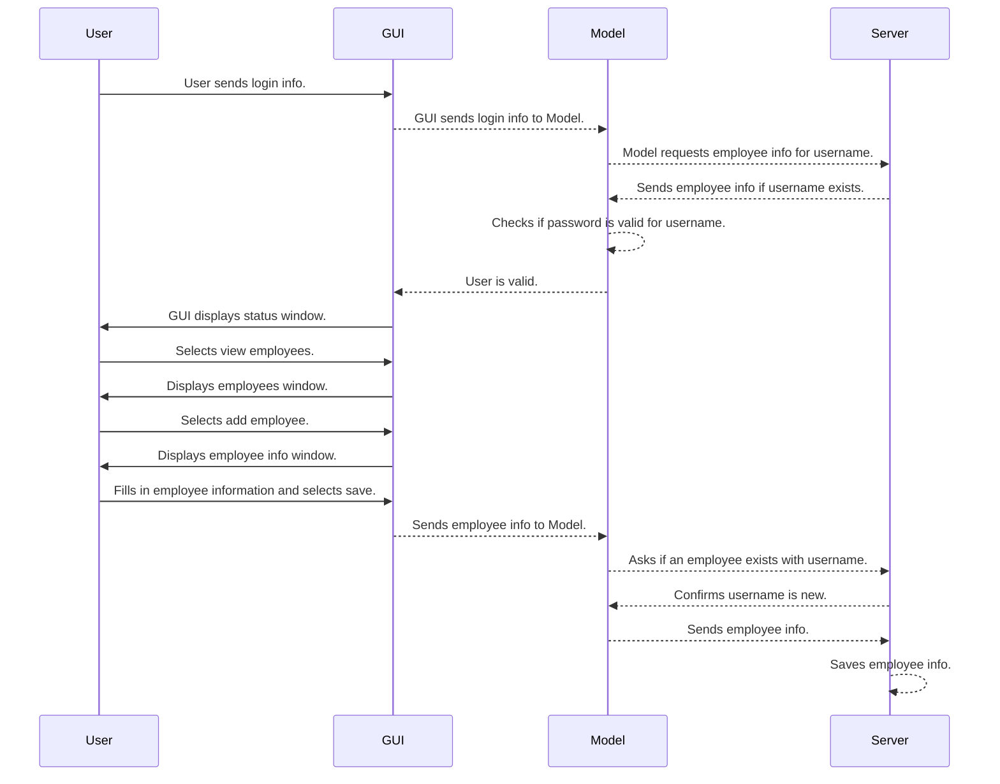

```mermaid
sequenceDiagram
User ->> GUI: User sends login info.
GUI -->> Model: GUI sends login info to Model.
Model -->> Server: Model requests employee info for username.
Server -->> Model: Sends employee info if username exists.
Model -->> Model: Checks if password is valid for username.
Model -->> GUI: User is valid.
GUI ->> User: GUI displays status window.
User ->> GUI: Selects view employees.
GUI ->> User: Displays employees window.
User ->> GUI: Selects add employee.
GUI ->> User: Displays employee info window.
User ->> GUI: Fills in employee information and selects save.
GUI -->> Model: Sends employee info to Model.
Model -->> Server: Asks if an employee exists with username.
Server -->> Model: Confirms username is new.
Model -->> Server: Sends employee info.
Server -->> Server: Saves employee info.
```