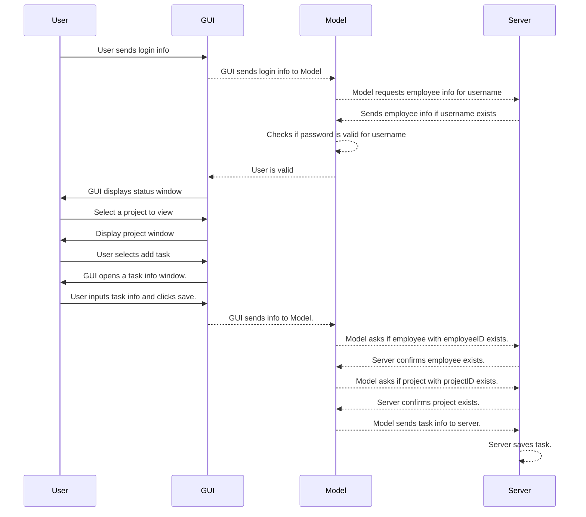

```mermaid
sequenceDiagram
User ->> GUI: User sends login info
GUI -->> Model: GUI sends login info to Model
Model -->> Server: Model requests employee info for username
Server -->> Model: Sends employee info if username exists
Model -->> Model: Checks if password is valid for username
Model -->> GUI: User is valid
GUI ->> User: GUI displays status window
User ->> GUI: Select a project to view
GUI ->> User: Display project window
User ->> GUI: User selects add task
GUI ->> User: GUI opens a task info window.
User ->> GUI: User inputs task info and clicks save.
GUI -->> Model: GUI sends info to Model.
Model -->> Server: Model asks if employee with employeeID exists.
Server -->> Model: Server confirms employee exists.
Model -->> Server: Model asks if project with projectID exists.
Server -->> Model: Server confirms project exists.
Model -->> Server: Model sends task info to server.
Server -->> Server: Server saves task.
```