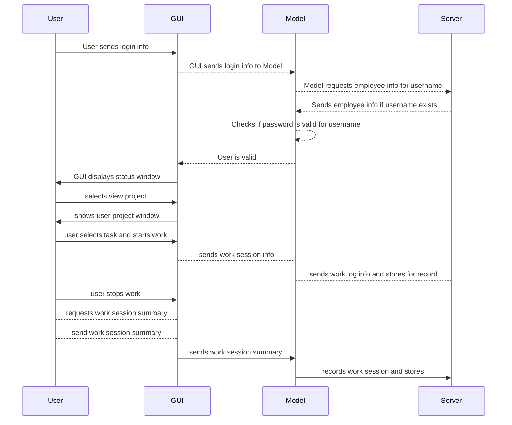

```mermaid 
sequenceDiagram 
User ->> GUI: User sends login info 
GUI -->> Model: GUI sends login info to Model 
Model -->> Server: Model requests employee info for username 
Server -->> Model: Sends employee info if username exists
Model -->> Model: Checks if password is valid for username 
Model -->> GUI: User is valid 
GUI ->> User: GUI displays status window 
User ->>GUI: selects view project 
GUI ->> User : shows user project window 
User->>GUI : user selects task and starts work 
GUI --> Model: sends work session info 
Model -->Server: sends work log info and stores for record 
User ->>GUI: user stops work 
GUI-->User: requests work session summary 
User-->GUI: send work session summary 
GUI->> Model: sends work session summary 
Model ->> Server: records work session and stores
```
